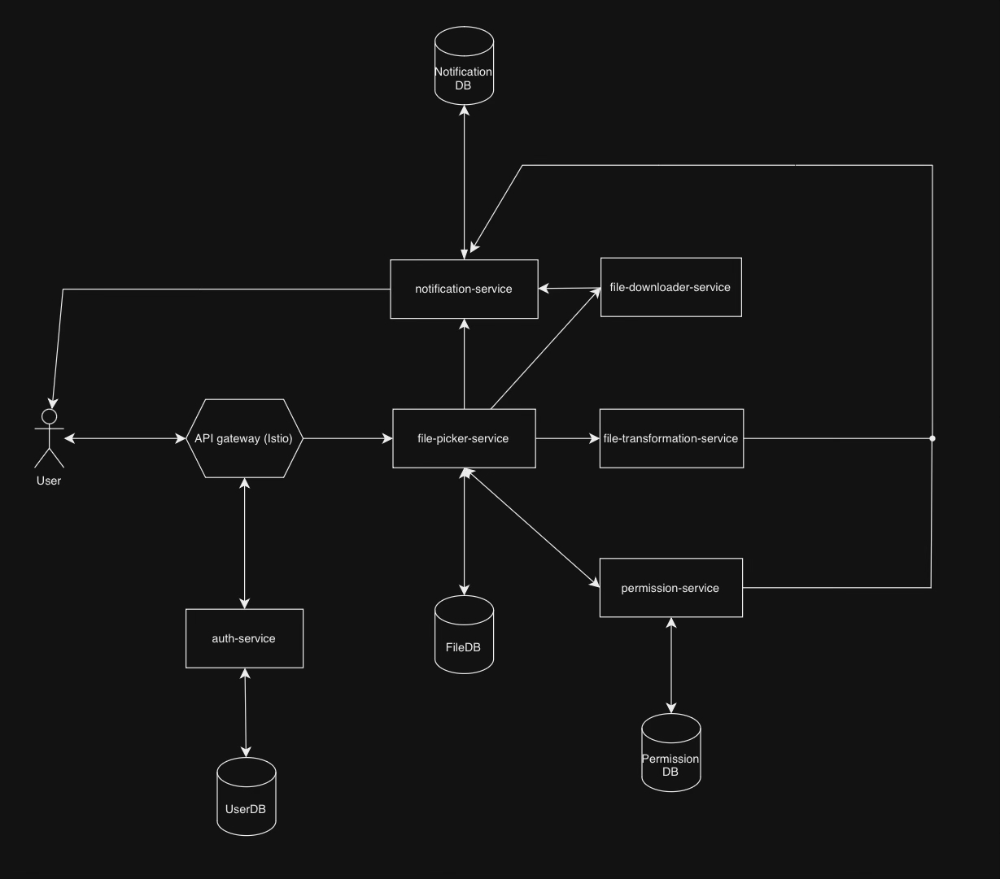

### System Design for Multi-Service File Management System

#### Objective:
Design and implement a highly available, scalable, and secure file management system. The system allows users to upload, share, download, and transform files, while interacting with cloud providers like Google Drive and Dropbox. The design must support complex permission management, file transformation, and notifications.

#### Assumptions:
- The project will be developed over 3-4 months.
- The system needs to handle both local file uploads and cloud file imports.
- Services should be resilient, easily extensible, and support high concurrency.
- The system will rely on Kubernetes for container orchestration and Istio for service mesh management.

---

### High-Level Architecture Overview

The system is composed of microservices that communicate using gRPC and HTTP protocols. The following diagram and descriptions detail how these services interact within a multi-service environment.

**High-Level Architecture Diagram:**

---

### Components & Services:

### **Updated Design Document for User-Facing APIs and gRPC Services**

This document now outlines the user-facing **REST APIs** exposed via the **File-Picker-Service**, alongside the **gRPC APIs** used for internal service communication. Only the **Auth-Service**, **File-Picker-Service**, and **Notification-Service** are exposed to the user. The other services, including **File-Downloader-Service**, **File-Transformation-Service**, and **Permission-Service**, operate using gRPC.

---

### **1. Auth-Service**

The **Auth-Service** handles user authentication and token issuance.

#### **User-Facing REST APIs**:

- **POST /auth/login**
  - **Description**: Logs in the user and returns a JWT token for further authorization.

- **POST /auth/register**
  - **Description**: Registers a new user.

- **POST /auth/logout**
  - **Description**: Logs out the user and invalidates their JWT token.

---

### **2. File-Picker-Service**

The **File-Picker-Service** handles file management for the user, including upload, listing files, triggering downloads, and requesting transformations.

#### **User-Facing REST APIs**:

- **POST /api/upload**
  - **Description**: Upload a file to the system. Internally interacts with the **Permission-Service** to verify access.

- **GET /api/files**
  - **Description**: List all files accessible to the authenticated user.

- **POST /api/files/download**
  - **Description**: Downloads a file from cloud storage and uploads it to the system. This triggers a gRPC call to the **File-Downloader-Service**.

- **POST /api/transform/:id**
  - **Description**: Request a file transformation. Internally interacts with the **File-Transformation-Service** to process the transformation and notifies the user via the **Notification-Service**.

- **POST /api/files/share**
  - **Description**: Share a file with another user by adding permissions. This action triggers a gRPC call to the **Permission-Service**.

#### **Internal gRPC APIs**:

- **UploadFile**: Handles the raw file upload to the system.
- **ListFiles**: Retrieves the list of files for a user.
- **RequestFileDownload**: Triggers the **File-Downloader-Service** to fetch files from cloud storage.
- **TriggerFileTransformation**: Sends a request to the **File-Transformation-Service** for processing.

---

### **3. File-Downloader-Service (gRPC Only)**

The **File-Downloader-Service** manages the downloading of files from cloud providers such as Google Drive or Dropbox.

#### **Internal gRPC APIs**:

- **DownloadFile**
  - **Description**: Downloads a file from a cloud provider using access tokens and stores it in the system.

---

### **4. File-Transformation-Service (gRPC Only)**

The **File-Transformation-Service** handles various file transformations such as OCR or image recognition.

#### **Internal gRPC APIs**:

- **TransformFile**
  - **Description**: Transforms a file (e.g., performs OCR or image recognition) based on the user's request.

---

### **5. Permission-Service (gRPC Only)**

The **Permission-Service** manages access control for files, allowing users to share files and modify access permissions.

#### **Internal gRPC APIs**:

- **CheckPermission**
  - **Description**: Verifies if a user has the necessary permissions (read, write, delete) for a specific file.

- **UpdatePermission**
  - **Description**: Updates the permission settings for shared files or folders, enabling the file owner to grant or revoke access.

---

### **6. Notification-Service (WebSocket)**

The **Notification-Service** sends real-time notifications to users regarding file uploads, transformations, and sharing events.

#### **User-Facing WebSocket API**:

- **WebSocket /notifications**
  - **Description**: Provides real-time notifications to the user for file-related events such as file uploads, transformations, and sharing.

---
### 7. Centralized PostgreSQL Database

- **Role**: A centralized database shared by multiple services, storing critical data such as file metadata, permissions, and user information.
- **Primary Functions**: Stores data for all services.
- **Considerations**: Handles high traffic and concurrent access with replication.

---

### File Lifecycle (File-State Machine)

The system manages the lifecycle of a file from its initial upload to potential transformations and access control updates.

1. **Upload**:
    - The user uploads a file through the **File-Picker-Service**.
    - If the file is uploaded from the cloud, the **File-Downloader-Service** fetches the file.
    - File metadata is stored in the database, and ownership permissions are set in the **Permission-Service**.

2. **Share**:
    - The file owner uses the **File-Picker-Service** to share the file, updating permissions via the **Permission-Service**.
    - Shared users gain read, write, or delete access based on the permissions set by the owner.

3. **Transformation**:
    - The user requests a transformation via the **File-Picker-Service**.
    - The **File-Transformation-Service** processes the file (e.g., resizing, OCR), and updates the file's metadata in the database.
    - The **Notification-Service** notifies the user upon completion of the transformation.

4. **Download**:
    - The user requests to download the file via the **File-Picker-Service**.
    - If it is a cloud-based file, the **File-Downloader-Service** retrieves the file.
    - The file is downloaded to local storage for the user.

---

### Data Models

The system employs a centralized PostgreSQL database for storing data across services.

#### **Files Table**

| Column      | Type    | Description                         |
|-------------|---------|-------------------------------------|
| `id`        | UUID    | Unique identifier for the file.     |
| `name`      | String  | Name of the file.                   |
| `path`      | String  | Path to the file in local storage.  |
| `owner_id`  | UUID    | User ID of the file owner.          |
| `is_shared` | Boolean | Flag indicating if the file is shared. |
| `created_at`| DateTime| Timestamp of file creation.         |
| `updated_at`| DateTime| Timestamp of last update.           |

#### **Permissions Table**

| Column        | Type    | Description                          |
|---------------|---------|--------------------------------------|
| `id`          | UUID    | Unique identifier for the permission entry. |
| `file_id`     | UUID    | ID of the file.                      |
| `user_id`     | UUID    | ID of the user.                      |
| `permissions` | String  | Comma-separated permissions (read, write, delete). |
| `is_owner`    | Boolean | Whether the user is the file owner.  |

#### **Transformation Jobs Table (Planned Improvement)**

| Column         | Type    | Description                          |
|----------------|---------|--------------------------------------|
| `id`           | UUID    | Unique identifier for the transformation job. |
| `file_id`      | UUID    | ID of the file being transformed.    |
| `status`       | String  | Job status (pending, processing, completed, failed). |
| `type`         | String  | Type of transformation (resize, OCR, etc.). |
| `created_at`   | DateTime| Timestamp when the job was created.  |

#### **Notifications Table (Planned Improvement)**

| Column         | Type    | Description                          |
|----------------|---------|--------------------------------------|
| `id`           | UUID    | Unique identifier for the notification. |
| `user_id`      | UUID    | ID of the user receiving the notification. |
| `message`      | String  | Content of the notification.         |
| `sent_at`      | DateTime| Timestamp when the notification was sent. |

---

### Deployment and Rollout Strategy

**Kubernetes Cluster Setup:**

1. **Centralized Database**:
   - Deploy a PostgreSQL database with replication enabled.
   - Use Kubernetes StatefulSets to ensure that the database has persistent storage.
   - Ensure the database is resilient and supports high concurrency by scaling horizontally.

2. **Istio Setup**:
   - Use Istio for managing internal traffic, security, and load balancing.
   - Enable mTLS for secure communication between services.
   - Implement traffic control policies for gradual rollouts and canary testing.

3. **Blue-Green Deployment**:
   - Utilize a blue-green deployment strategy for services to minimize downtime and allow easy rollback.

4. **Scaling**:
   - Use Horizontal Pod Autoscalers (HPA) to scale services based on CPU and memory utilization.

---

### Testing & Rollout Plan

**Unit Testing**:
- Each service should have unit tests for its core functionality.
- Auth-Service tests user authentication and token generation.
- File-Picker-Service tests file uploads, listings, and permission checks.
  
**Integration Testing**:
- Ensure services communicate seamlessly by testing end-to-end scenarios (e.g., file upload, transformation, and notification).

**Load Testing**:
- Perform load testing on critical services like File-Picker and File-Transformation to handle high traffic efficiently.

**Rollout Strategy**:
- Use blue-green or canary deployments for safe updates.
- Monitor services using Prometheus and Grafana to detect issues early.

---